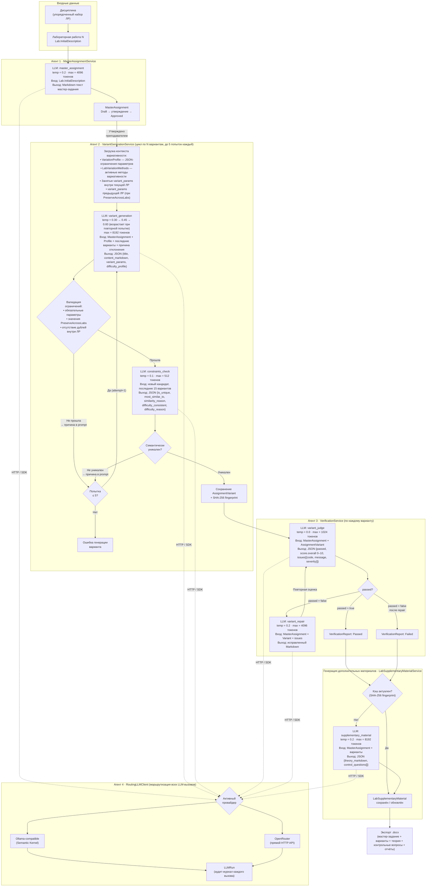
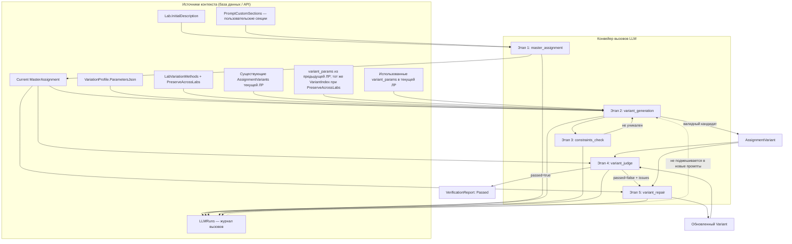

# Программный комплекс автоматизированной генерации лабораторных заданий

Настоящий документ содержит описание программного комплекса, состоящего из двух компонентов:
- `LabGenerator` — серверная часть (ASP.NET Core Web API, SQLite, фоновые службы обработки задач).
- `lab-generator-frontend` — клиентская веб-часть (Next.js, React, React Query, Zod, Tailwind CSS, shadcn/ui).

## 1. Назначение комплекса

Программный комплекс предназначен для автоматизации процессов создания, сопровождения и контроля качества лабораторных заданий в рамках учебного процесса высшего учебного заведения. Комплекс обеспечивает выполнение следующих функций:

- хранение сведений о дисциплинах и лабораторных работах;
- поддержка версионирования мастер-задания (черновик / утверждённая версия) с сохранением текущей актуальной версии;
- генерация мастер-задания (базового задания лабораторной работы) с использованием большой языковой модели (LLM);
- предоставление возможности редактирования мастер-задания и его утверждения для последующей генерации вариантов;
- автоматическое создание новой версии в статусе `Draft` при сохранении изменений в утверждённом мастер-задании;
- формирование набора уникальных вариантов на основе утверждённого мастер-задания;
- проведение верификации вариантов с формированием отчёта и, при необходимости, запуск автоматической корректировки;
- генерация дополнительных учебных материалов (теоретические сведения и контрольные вопросы);
- настройка пользовательских секций промптов для управления требованиями к генерируемому содержимому;
- управление ключами доступа к LLM-провайдерам через интерфейс администрирования;
- экспорт итоговых материалов в формате `.docx`;
- ведение журнала вызовов LLM и истории выполнения фоновых задач.

Комплекс ориентирован на преподавателя, осуществляющего полный цикл подготовки учебных материалов — от формирования структуры дисциплины до выпуска набора верифицированных вариантов заданий.


## 2. Технологический стек

### Серверная часть (`LabGenerator`)
- .NET `10.0` (проекты `Domain`, `Application`, `Infrastructure`, `WebAPI`, `Tests`, `TeacherEmulator`)
- ASP.NET Core Web API
- Entity Framework Core + SQLite
- Microsoft Semantic Kernel (Ollama-compatible LLM)
- OpenRouter (LLM через HTTP API)
- OpenXML SDK (экспорт `.docx`)
- Hosted Services (фоновый обработчик задач и автоматическое применение миграций базы данных)

### Клиентская часть (`lab-generator-frontend`)
- Next.js `16.1.6` (App Router)
- React `19.x`
- TypeScript
- @tanstack/react-query
- axios
- zod (валидация контрактов API)
- Tailwind CSS + shadcn/ui + Radix UI

## 3. Архитектура

### 3.1. Общая схема

```text
Browser
  -> Next.js клиентская часть (порт 3000)
    -> rewrite /api/* -> серверный WebAPI (порт 8080)
      -> SQLite (labgenius.db; в Docker том `./data`)
      -> LLM API (Ollama-compatible или OpenRouter)

Фоновые службы серверной части:
  - DatabaseMigrationService (применение миграций при запуске приложения)
  - GenerationJobWorker (выполнение отложенных задач генерации и верификации)
```

### 3.2. Серверная часть по слоям

- `LabGenerator.Domain`
  - доменные сущности (`Discipline`, `Lab`, `MasterAssignment`, `AssignmentVariant`, `GenerationJob`, `LlmProviderSettings`, `PromptCustomSection` и др.)
  - перечисления статусов (`GenerationJobStatus`, `GenerationJobType`, `MasterAssignmentStatus`)

- `LabGenerator.Application`
  - абстракции сервисов (`IMasterAssignmentService`, `IVariantGenerationService`, `IVerificationService`, `ILabSupplementaryMaterialService`, `IDocxExportService`, `ILLMClient`)
  - модели запросов к LLM
  - `DifficultyDefaults` — модель целевых параметров сложности (Complexity, EstimatedHoursMin, EstimatedHoursMax); глобальные значения задаются в `difficulty_defaults.json`, профиль вариативности может переопределить их посредством `DifficultyTargetJson`

- `LabGenerator.Infrastructure`
  - `ApplicationDbContext`, конфигурации EF Core, миграции
  - реализации сервисов генерации, верификации, генерации дополнительных материалов и экспорта
  - `LlmPromptTemplateService` — централизованное управление шаблонами промптов с подстановкой переменных
  - `PromptCustomSectionService` — управление пользовательскими секциями промптов с возможностью настройки и сброса к значениям по умолчанию
  - `LlmAccessGuardService` — проверка наличия сконфигурированного ключа доступа к LLM-провайдеру перед выполнением операций генерации
  - LLM-клиент с маршрутизацией провайдера: Ollama-compatible (Semantic Kernel) или OpenRouter
  - фоновые сервисы (`GenerationJobWorker`, `DatabaseMigrationService`)

- `LabGenerator.WebAPI`
  - REST-контроллеры
  - DI-композиция, подключение базы данных и фоновых служб
  - постраничная выдача данных (`PagedResponse<T>`) с поддержкой сортировки и поиска

- `LabGenerator.Tests`
  - модульные тесты сервисов и контроллеров

### 3.3. Алгоритм генерации вариантов

Ниже представлена полная цепочка агентов и вызовов LLM, через которую проходит каждая лабораторная работа дисциплины — от краткого описания до набора верифицированных вариантов заданий.



#### Описание агентов

| Агент | Сервис | Вызовы LLM | Назначение |
|-------|--------|-----------|------------|
| **Агент 1** | `MasterAssignmentService` | `master_assignment` (1 вызов) | По краткому описанию лабораторной работы генерирует развёрнутое мастер-задание в формате Markdown. Содержимое промпта определяется шаблоном `LlmPromptTemplateService` с подстановкой пользовательской секции `master_requirements` из `PromptCustomSectionService`. Результат сохраняется в статусе `Draft`; после рассмотрения преподавателем переводится в статус `Approved`. Для генерации вариантов используется исключительно утверждённая версия. |
| **Агент 2** | `VariantGenerationService` | `variant_generation` + `constraints_check` (2 вызова на каждую попытку) | Для каждого из N вариантов выполняет цикл: генерирует кандидата, проверяет структурные ограничения вариативности и семантическую уникальность. При неудаче передаёт в LLM причину отклонения; температура возрастает с каждой попыткой для увеличения разнообразия. Параметр `PreserveAcrossLabs` обеспечивает связывание значений параметров между лабораторными работами одной дисциплины. |
| **Агент 3** | `VerificationService` | `variant_judge` + `variant_repair` (1–2 вызова) | Оценивает готовый вариант посредством детерминированного оценщика (`temp=0.0`). При неудовлетворительной оценке запускает автоматическую корректировку и повторную оценку. Итоговый результат сохраняется в `VerificationReport`. |
| **Генерация материалов** | `LabSupplementaryMaterialService` | `supplementary_material` (1 вызов) | По утверждённому мастер-заданию и набору вариантов генерирует теоретический материал (Markdown) и контрольные вопросы (JSON-массив). Требования к содержимому определяются пользовательской секцией `material_requirements`. Результат кэшируется по SHA-256 отпечатку; повторная генерация выполняется только при изменении исходных данных или принудительном запросе. |
| **Агент 4** | `RoutingLLMClient` | — (инфраструктура) | Маршрутизирует все LLM-запросы к активному провайдеру (Ollama-compatible через Semantic Kernel или OpenRouter через HTTP). Ключ доступа считывается из `LlmProviderSettings` в базе данных. Каждый вызов записывается в `LLMRun` с указанием количества токенов, задержки и исходного JSON-ответа. |

### 3.4. Клиентская часть

- Страницы:
  - `/` — стартовая страница
  - `/disciplines` — управление дисциплинами
  - `/labs` — управление лабораторными работами (с постраничной навигацией и поиском)
  - `/labs/[labId]` — основной рабочий экран лабораторной работы (вкладки: мастер-задание, варианты, материалы, верификация)
  - `/admin/llm` — администрирование настроек LLM-провайдеров (выбор провайдера, модели, управление ключами доступа, настройка пользовательских секций промптов)

- Слой данных:
  - `src/shared/api/http.ts` — axios-клиент (`baseURL: /api`)
  - `src/shared/hooks/*` — запросы и мутации на основе React Query
  - `src/shared/contracts/*` — zod-схемы объектов передачи данных (DTO)

- Проксирование API:
  - `next.config.ts` перенаправляет `/api/:path*` на серверную часть (`NEXT_PUBLIC_API_BASE_URL`).

## 4. Структура каталогов

```text
LabGenerator/
  LabGenerator.Domain/
  LabGenerator.Application/
  LabGenerator.Infrastructure/
    Data/
    Jobs/
    Llm/
    Services/
  LabGenerator.WebAPI/
  LabGenerator.Tests/
  LabGenerator.TeacherEmulator/
  compose.yaml
  .env.example

lab-generator-frontend/
  src/app/
  src/components/
  src/shared/
  next.config.ts
  package.json
```

## 5. Ключевая функциональность

### 5.1. Основной пользовательский сценарий

1. Создать дисциплину на странице управления дисциплинами: указать наименование и описание учебной области.
2. Создать лабораторную работу на странице управления лабораторными работами: выбрать дисциплину, задать порядковый номер, наименование и краткое описание задания.
3. Открыть страницу лабораторной работы `/labs/{labId}` и на вкладке мастер-задания запустить генерацию.
4. Дождаться завершения фоновой задачи генерации: статус отслеживается по индикатору задачи и через `GET /api/jobs/{id}`.
5. Проверить текст мастер-задания в редакторе, при необходимости внести изменения и сохранить (кнопка сохранения активна только при наличии изменений).
6. Если редактируется утверждённая версия (`Approved`), при сохранении система автоматически создаёт новую текущую версию в статусе `Draft` с увеличенным номером версии.
7. Утвердить подготовленную версию. Кнопка утверждения недоступна при наличии несохранённых изменений.
8. На вкладке вариантов выбрать методы вариативности и при необходимости отметить параметры с переносом значений между лабораторными работами (`PreserveAcrossLabs`).
9. Указать количество вариантов и запустить генерацию. Генерация доступна только при наличии утверждённого мастер-задания и сконфигурированного ключа доступа к LLM-провайдеру.
10. Выполнить проверку: для одного варианта — кнопкой в строке таблицы, для всех вариантов — из вкладки верификации.
11. Просмотреть отчёты проверки (статус, итоговая оценка, перечень замечаний) и при необходимости повторить генерацию или проверку.
12. Перейти на вкладку материалов и запустить генерацию теоретического материала и контрольных вопросов (доступно при утверждённом мастер-задании и наличии вариантов). При необходимости выполнить принудительную перегенерацию.
13. Экспортировать итоговый документ (экспорт включает мастер-задание, варианты, теоретические сведения и контрольные вопросы).

### 5.2. Асинхронные фоновые задачи

Типы задач (`GenerationJobType`):
- `GenerateMasterAssignment`
- `GenerateVariants`
- `VerifyVariants`
- `GenerateTheory`

Статусы (`GenerationJobStatus`):
- `Pending`
- `InProgress`
- `Succeeded`
- `Failed`
- `Canceled`

Особенности фонового обработчика:
- извлекает задачи в статусе `Pending`, упорядоченные по дате создания;
- присваивает статус `Failed` задачам, находящимся в статусе `InProgress` более 10 минут;
- прогресс проверки вариантов обновляется по мере обхода.

### 5.3. Генерация мастер-задания

`MasterAssignmentService`:
- выбирает лабораторную работу;
- деактивирует предыдущее текущее мастер-задание (`IsCurrent`);
- формирует промпт на основе шаблона `LlmPromptTemplateService` с подстановкой пользовательской секции требований из `PromptCustomSectionService`;
- генерирует текст мастер-задания в формате Markdown посредством LLM;
- сохраняет запись вызова LLM (`LLMRun`);
- создаёт новую версию мастер-задания в статусе `Draft`;
- при обновлении содержимого утверждённой версии автоматически создаёт новую текущую версию в статусе `Draft`.

### 5.4. Генерация вариантов

`VariantGenerationService`:
- использует текущее утверждённое мастер-задание (`Approved`);
- учитывает параметры профиля вариативности (`VariationProfile`), если таковой задан;
- учитывает выбранные методы вариативности (`LabVariationMethods`);
- обеспечивает перенос значений между смежными лабораторными работами дисциплины (`PreserveAcrossLabs`);
- контролирует уникальность значений внутри текущей лабораторной работы;
- проверяет семантическую уникальность нового варианта относительно существующих посредством дополнительного вызова LLM (`constraints_check`);
- создаёт контрольный отпечаток содержимого (SHA-256 short);
- включает в промпт целевые параметры сложности (`Complexity`, `EstimatedHoursMin`, `EstimatedHoursMax`): переопределение из `VariationProfile.DifficultyTargetJson` (профиль по умолчанию для лабораторной работы) или глобальные значения из `difficulty_defaults.json`.

В случае непрохождения проверок сервис выполняет повторные попытки генерации.

### 5.5. Верификация

`VerificationService`:
- сравнивает вариант с мастер-заданием посредством LLM-оценщика (строгий JSON-формат ответа);
- при неудовлетворительной оценке запускает этап автоматической корректировки и повторную оценку;
- результат сохраняется в `VerificationReport`.

### 5.6. Генерация дополнительных материалов

`LabSupplementaryMaterialService`:
- генерирует теоретический материал (Markdown) и контрольные вопросы (JSON-массив) на основе утверждённого мастер-задания и существующих вариантов;
- использует LLM с параметрами: `temp = 0.2`, `max = 8192` токенов, `purpose = supplementary_material`;
- требования к содержимому формируются на основе пользовательской секции `material_requirements` из `PromptCustomSectionService`;
- кэширует результат по SHA-256 отпечатку (объединение мастер-задания и отпечатков вариантов); при изменении мастер-задания или вариантов кэш автоматически инвалидируется;
- поддерживает принудительную перегенерацию (`force = true`).

### 5.7. Экспорт

`DocxExportService` формирует документ `.docx`, содержащий:
- заголовок лабораторной работы и краткое описание;
- текущее мастер-задание;
- перечень вариантов;
- теоретический материал и контрольные вопросы (при наличии);
- статус верификации по каждому варианту.

### 5.8. Управление шаблонами промптов

`LlmPromptTemplateService` обеспечивает централизованное управление шаблонами промптов для всех этапов генерации. Каждый шаблон определяет системный промпт, пользовательский промпт и опциональный суффикс для повторных попыток. Подстановка переменных осуществляется через двойные фигурные скобки (`{{variable_name}}`).

Определены шаблоны для следующих целей:
- `master_assignment` — генерация мастер-задания;
- `variant_generation` — генерация вариантов;
- `constraints_check` — проверка уникальности и соответствия сложности;
- `supplementary_material` — генерация теоретических сведений и контрольных вопросов;
- `variant_judge` — верификация варианта;
- `variant_repair` — автоматическая корректировка варианта.

### 5.9. Пользовательские секции промптов

`PromptCustomSectionService` предоставляет возможность настройки содержимого отдельных секций промптов через API. Поддерживаются следующие секции:

| Ключ секции | Назначение |
|-------------|------------|
| `master_requirements` | Требования к содержимому мастер-задания |
| `material_requirements` | Требования к теоретическим сведениям и контрольным вопросам |

Для каждой секции предусмотрено значение по умолчанию. Пользовательские изменения сохраняются в базе данных и при необходимости могут быть сброшены к значениям по умолчанию.

### 5.10. Контроль доступа к LLM-провайдеру

`LlmAccessGuardService` выполняет проверку наличия сконфигурированного ключа доступа к текущему LLM-провайдеру перед запуском операций генерации. При отсутствии ключа операция отклоняется с информативным сообщением об ошибке.

### 5.11. Контекст LLM по этапам генерации и проверки

Ниже представлена схема, отражающая состав данных, подаваемых в контекст LLM на основных этапах, а также взаимосвязи между итерациями генерации.



Ключевые положения:
- История предшествующих генераций учитывается через `AssignmentVariants` и `variant_params` (внутри текущей лабораторной работы и, при использовании `PreserveAcrossLabs`, из предыдущей лабораторной работы для того же номера варианта).
- Этап `variant_generation` получает ограничения вариативности, контекст существующих вариантов и причину отклонения предыдущей попытки (при наличии).
- Этап `constraints_check` сравнивает нового кандидата с существующими вариантами по семантическому содержанию и соответствию параметрам сложности.
- Этап `variant_judge` оценивает соответствие варианта мастер-заданию по строгой JSON-схеме.
- Этап `variant_repair` запускается исключительно при неудовлетворительной оценке; после корректировки повторно вызывается `variant_judge`.
- Пользовательские секции промптов (`PromptCustomSections`) подставляются в шаблоны на этапах генерации мастер-задания и дополнительных материалов.
- Записи `LLMRuns` сохраняют историю вызовов для аудита и диагностики, однако не используются в качестве входного контекста для последующих вызовов LLM.

## 6. Модель данных (основные сущности)

- `Discipline` -> множество `Lab`
- `Lab` -> множество `MasterAssignment`, `AssignmentVariant`, `VariationProfile`, `LabSupplementaryMaterial`
- `VariationMethod` -> справочник методов вариативности (включая системные начальные записи)
- `LabVariationMethod` -> методы вариативности, применённые к конкретной лабораторной работе
- `MasterAssignment` -> версии мастер-задания (`IsCurrent`, `Draft/Approved`)
- `AssignmentVariant` -> конкретный вариант задания
- `VerificationReport` -> отчёт проверки варианта
- `LabSupplementaryMaterial` -> теоретический материал и контрольные вопросы для лабораторной работы (с кэшированием по SHA-256 отпечатку мастер-задания и вариантов)
- `PromptCustomSection` -> пользовательские секции промптов (ключ секции, содержимое, дата последнего обновления)
- `LLMRun` -> журнал каждого вызова LLM
- `LlmSettings` -> активный LLM-провайдер и модель (глобальные настройки)
- `LlmProviderSettings` -> параметры конкретного провайдера (модель, ключ доступа, температура, максимальное количество выходных токенов)
- `GenerationJob` -> очередь и история фоновых задач
- `VariationProfile` содержит поле `DifficultyTargetJson` (nullable): при наличии значения переопределяет глобальные параметры сложности для данной лабораторной работы; при отсутствии используются значения из `difficulty_defaults.json`

## 7. REST API (основные маршруты)

### Дисциплины и лабораторные работы
- `GET /api/disciplines` — перечень дисциплин с указанием количества лабораторных работ
- `POST /api/disciplines` — создание дисциплины
- `GET /api/labs` — перечень лабораторных работ (параметры: `page`, `pageSize`, `sort`, `search`, `all`)
- `GET /api/labs/{labId}` — получение сведений о лабораторной работе
- `POST /api/labs` — создание лабораторной работы

### Мастер-задание
- `GET /api/labs/{labId}/master` — текущее мастер-задание
- `POST /api/labs/{labId}/master/generate` — запуск генерации мастер-задания
- `PUT /api/labs/{labId}/master/{masterAssignmentId}` — обновление содержимого мастер-задания
- `POST /api/labs/{labId}/master/{masterAssignmentId}/approve` — утверждение мастер-задания

### Методы вариативности
- `GET /api/variation-methods` — справочник методов вариативности
- `POST /api/variation-methods` — добавление метода
- `PUT /api/variation-methods/{id}` — обновление метода
- `DELETE /api/variation-methods/{id}` — удаление метода
- `GET /api/labs/{labId}/variation-methods` — методы вариативности, назначенные лабораторной работе
- `PUT /api/labs/{labId}/variation-methods` — назначение методов вариативности лабораторной работе

### Профили вариативности
- `GET /api/labs/{labId}/variation-profiles` — профили вариативности лабораторной работы
- `POST /api/labs/{labId}/variation-profiles` — создание профиля вариативности

### Параметры сложности
- `GET /api/labs/{labId}/difficulty-target` — текущая целевая сложность (поле `IsOverridden=true` — задано переопределение в профиле, `false` — используются глобальные значения по умолчанию)
- `PUT /api/labs/{labId}/difficulty-target` — установка переопределения (`Complexity`, `EstimatedHoursMin`, `EstimatedHoursMax`); при отсутствии профиля по умолчанию создаётся новый
- `DELETE /api/labs/{labId}/difficulty-target` — сброс переопределения; лабораторная работа возвращается к глобальным значениям по умолчанию

### Дополнительные материалы
- `GET /api/labs/{labId}/supplementary-material` — текущий сгенерированный материал (404, если не создан)
- `POST /api/labs/{labId}/supplementary-material/generate` — запуск фоновой задачи генерации (`{ "force": true }` для принудительной перегенерации)

### Варианты и верификация
- `GET /api/labs/{labId}/variants` — перечень вариантов (параметры: `page`, `pageSize`, `sort`)
- `POST /api/labs/{labId}/variants/generate` — запуск генерации вариантов
- `POST /api/labs/{labId}/verify` — запуск верификации вариантов
- `GET /api/variants/{variantId}/verification` — отчёт верификации варианта
- `GET /api/labs/{labId}/verification-reports` — все отчёты верификации лабораторной работы

### Статус задач и экспорт
- `GET /api/jobs/{id}` — статус фоновой задачи
- `GET /api/labs/{labId}/export/docx` — экспорт документа

### Администрирование настроек LLM
- `GET /api/admin/llm-settings` — текущие глобальные настройки LLM
- `PUT /api/admin/llm-settings` — обновление глобальных настроек LLM
- `GET /api/admin/llm-provider-settings/{provider}` — параметры провайдера (модель, маскированный ключ доступа, температура, максимальное количество токенов)
- `PUT /api/admin/llm-provider-settings/{provider}` — обновление параметров провайдера (включая ключ доступа; `clearApiKey: true` для удаления ключа)

### Пользовательские секции промптов
- `GET /api/prompt-sections` — перечень всех секций с текущим содержимым
- `GET /api/prompt-sections/{sectionKey}` — содержимое секции по ключу
- `PUT /api/prompt-sections/{sectionKey}` — обновление содержимого секции
- `DELETE /api/prompt-sections/{sectionKey}` — сброс секции к значению по умолчанию

Примечание для `PUT /api/labs/{labId}/master/{masterAssignmentId}`:
- при сохранении версии в статусе `Draft` запись обновляется непосредственно;
- при сохранении версии в статусе `Approved` создаётся новая текущая версия в статусе `Draft`.

Примечание: маршрут OpenAPI публикуется только в режиме Development (`MapOpenApi`).

## 8. Установка и запуск

### 8.1. Требования

- Docker + Docker Compose (рекомендуемый способ), либо:
  - .NET SDK `10.x`
  - Node.js `20.x`
  - доступ к LLM-провайдеру (Ollama-compatible или OpenRouter)

### 8.2. Запуск посредством Docker Compose (рекомендуется)

Перед первым запуском необходимо заполнить локальный файл `LabGenerator/.env` на основе шаблона `LabGenerator/.env.example`.

Пример содержимого:

```env
OLLAMA_API_KEY=your-ollama-api-key
OPENROUTER_API_KEY=your-openrouter-api-key
```

`compose.yaml` считывает указанные переменные и подставляет их в настройки приложения `LLM__Ollama__ApiKey` и `LLM__OpenRouter__ApiKey`.

```powershell
cd LabGenerator
docker compose up --build
```

Сервисы:
- Клиентская часть: `http://localhost:3000`
- WebAPI: `http://localhost:8080`
- Файл базы данных SQLite: `LabGenerator/data/labgenius.db` (том `./data` внутри `LabGenerator`)

Файл `LabGenerator/.env` добавлен в `.gitignore` и должен оставаться локальным.

Ключи доступа к LLM-провайдерам также могут быть заданы через интерфейс администрирования (`PUT /api/admin/llm-provider-settings/{provider}`) после запуска комплекса, без необходимости перезапуска.

### 8.3. Локальный запуск без Docker

1. База данных — файл SQLite. По умолчанию создаётся `labgenius.db` в каталоге запуска; путь может быть указан через `ConnectionStrings__DefaultConnection`.

2. Запуск серверной части (пример для PowerShell):

```powershell
cd LabGenerator
$env:ConnectionStrings__DefaultConnection = "Data Source=labgenius.db"
$env:ApplicationSettings__PgAutoMigrations = "true"
$env:ApplicationSettings__LogLlmRequests = "true"
$env:LLM__Provider = "Ollama"
$env:LLM__Ollama__BaseUrl = "http://localhost:11434"
$env:LLM__Ollama__Model = "llama3.1:8b"
$env:LLM__Ollama__ApiKey = ""
$env:ASPNETCORE_ENVIRONMENT = "Development"
dotnet run --project .\LabGenerator.WebAPI --urls http://localhost:8080
```

При использовании OpenRouter необходимо задать `LLM__Provider = "OpenRouter"` и установить `LLM__OpenRouter__ApiKey` (при необходимости также `LLM__OpenRouter__Model`).

3. В отдельном терминале запустить клиентскую часть:

```powershell
cd lab-generator-frontend
$env:NEXT_PUBLIC_API_BASE_URL = "http://localhost:8080"
npm ci
npm run dev
```

4. Открыть `http://localhost:3000`.

## 9. Конфигурация

### Глобальные параметры сложности (`difficulty_defaults.json`)

Файл `LabGenerator/LabGenerator.WebAPI/difficulty_defaults.json` задаёт значения по умолчанию для целевых параметров сложности вариантов (применяются, если профиль вариативности не содержит переопределения):

```json
{
  "DifficultyDefaults": {
    "Complexity": "medium",
    "EstimatedHoursMin": 4,
    "EstimatedHoursMax": 8
  }
}
```

Допустимые значения `Complexity`: `low`, `medium`, `high`. Для переопределения сложности отдельной лабораторной работы без изменения файла следует использовать `PUT /api/labs/{labId}/difficulty-target`.

### Основные параметры серверной части
- `ConnectionStrings__DefaultConnection`
- `ApplicationSettings__PgAutoMigrations` (автоматическое применение миграций при запуске)
- `ApplicationSettings__LogLlmRequests`
- `ApplicationSettings__LogLlmMaxChars`
- `ApplicationSettings__LlmRequestTimeoutSeconds`
- `ApplicationSettings__LlmRetryCount`
- `ApplicationSettings__LlmRetryMaxDelaySeconds`
- `LLM__Provider` (Ollama/OpenRouter)
- `LLM__Ollama__BaseUrl`
- `LLM__Ollama__Model`
- `LLM__Ollama__Temperature`
- `LLM__Ollama__MaxOutputTokens`
- `LLM__Ollama__ApiKey`
- `LLM__OpenRouter__BaseUrl`
- `LLM__OpenRouter__Model`
- `LLM__OpenRouter__Temperature`
- `LLM__OpenRouter__MaxOutputTokens`
- `LLM__OpenRouter__ApiKey`

Провайдер LLM выбирается посредством переменной `LLM__Provider` или через `PUT /api/admin/llm-settings`. Параметры конкретного провайдера (включая ключ доступа) могут быть заданы через переменные окружения при запуске или обновлены через `PUT /api/admin/llm-provider-settings/{provider}` в процессе эксплуатации. Ключи доступа, заданные через API, сохраняются в базе данных и имеют приоритет над переменными окружения.

При запуске посредством Docker Compose ключи удобнее задавать в `LabGenerator/.env` как `OLLAMA_API_KEY` и `OPENROUTER_API_KEY`; `compose.yaml` транслирует их в `LLM__Ollama__ApiKey` и `LLM__OpenRouter__ApiKey`.

## 10. Эксплуатация, мониторинг, обслуживание

- Состояние фоновых операций проверяется через `GET /api/jobs/{id}`.
- Детали и трассировка вызовов LLM хранятся в таблице `LLMRuns`.
- История ошибок фоновых задач и результаты — в таблице `GenerationJobs`.
- Миграции применяются при запуске при включённом параметре `PgAutoMigrations`.
- Готовность LLM-провайдера может быть проверена косвенно через наличие ключа доступа в `GET /api/admin/llm-provider-settings/{provider}` (поле `hasApiKey`).

## 11. Ограничения текущей реализации

- Отсутствует аутентификация и авторизация API.
- Отсутствует маршрут отмены фоновых задач (статус `Canceled` предусмотрен в перечислении, однако маршрут отмены не реализован).
- Вариативные значения сохраняются в поле `variant_params` (JSON) внутри `AssignmentVariant`; отдельная сущность `AssignmentVariantVariationValue` в текущем рабочем процессе практически не используется.
- Экспорт реализован исключительно в формате DOCX.
- OpenAPI публикуется только в режиме Development.

## 12. Рекомендации по дальнейшему развитию

- Реализовать аутентификацию, авторизацию и ролевую модель.
- Вынести ключи доступа в безопасное хранилище (Docker secrets / Vault / CI secrets).
- Реализовать маршрут отмены задач и механизм повторного запуска.
- Расширить набор интеграционных и сквозных тестов ключевых сценариев.


## 13. Эмулятор преподавателя для интеграционного тестирования

Проект расположен в каталоге `LabGenerator/LabGenerator.TeacherEmulator`.

Эмулятор преподавателя предназначен для сквозной интеграционной проверки комплекса LabGenerator. Он воспроизводит типовой рабочий процесс преподавателя и последовательно выполняет все ключевые операции через публичный API системы.

В рамках одного запуска эмулятор выполняет следующие действия:
1. Создаёт дисциплину, включая наименование и описание.
2. Создаёт заданное количество лабораторных работ.
3. Для каждой лабораторной работы запускает генерацию мастер-задания и ожидает завершения фоновой задачи.
4. После получения черновика выполняет проверку текста, при необходимости вносит правки и утверждает итоговую версию.
5. Настраивает методы вариативности и параметры переноса значений между лабораторными работами (`PreserveAcrossLabs`).
6. Запускает генерацию вариантов заданий и ожидает завершения фоновой задачи.
7. Инициирует верификацию вариантов, анализирует отчёты и при необходимости выполняет повторные операции генерации и проверки.
8. Формирует итоговые отчёты в форматах `JSON` и `Markdown`.

### 13.1. Этапы вызова LLM-преподавателя

LLM-преподаватель вызывается исключительно на трёх строго определённых этапах сценария:
1. На этапе планирования дисциплины и перечня лабораторных работ (один вызов на весь запуск).
2. На этапе экспертного рассмотрения мастер-задания для каждой лабораторной работы (один вызов на каждую работу).
3. На этапе выбора методов вариативности для каждой лабораторной работы (один вызов на каждую работу).

При `LG_EMULATOR_LAB_COUNT=3` общее количество вызовов LLM-преподавателя составляет `1 + 3 + 3 = 7`.

### 13.2. Обработка отказов и повторные попытки

В случае неуспешного завершения генерации вариантов эмулятор последовательно применяет резервные стратегии:
1. Повторяет генерацию с исходным набором методов вариативности.
2. Повторяет генерацию с минимальным набором методов.
3. Повторяет генерацию без методов вариативности.

После верификации эмулятор анализирует статусы вариантов. Для вариантов с неудовлетворительным результатом он выполняет повторную верификацию (в пределах `LG_EMULATOR_MAX_VERIFY_RETRIES`) и, при необходимости, повторную генерацию с последующей верификацией (в пределах `LG_EMULATOR_MAX_REGEN_RETRIES`).

### 13.3. Запуск

Посредством файла `.env` (рекомендуемый способ, ключ `OPENROUTER_API_KEY` в `LabGenerator/.env`):

```powershell
cd LabGenerator
dotnet run --project .\LabGenerator.TeacherEmulator
```

Посредством аргумента командной строки:

```powershell
cd LabGenerator
dotnet run --project .\LabGenerator.TeacherEmulator -- --ollama-api-key=<OPENROUTER_KEY>
```

Посредством переменной окружения:

```powershell
cd LabGenerator
$env:OPENROUTER_API_KEY = "<OPENROUTER_KEY>"
dotnet run --project .\LabGenerator.TeacherEmulator
```

### 13.4. Основные параметры конфигурации

Эмулятор поддерживает следующие переменные окружения:
- `LG_EMULATOR_API_BASE_URL` (по умолчанию: `http://localhost:8080`).
- `LG_EMULATOR_OLLAMA_BASE_URL` (по умолчанию: `https://openrouter.ai`).
- `LG_EMULATOR_OLLAMA_API_KEY`.
- `LG_EMULATOR_TEACHER_MODEL` (по умолчанию: `deepseek-v3.2:cloud`).
- `LG_EMULATOR_SEED_TOPIC`.
- `LG_EMULATOR_LAB_COUNT` (по умолчанию: `3`).
- `LG_EMULATOR_VARIANT_COUNT` (по умолчанию: `6`).
- `LG_EMULATOR_MAX_VERIFY_RETRIES` (по умолчанию: `1`).
- `LG_EMULATOR_MAX_REGEN_RETRIES` (по умолчанию: `1`).
- `LG_EMULATOR_JOB_TIMEOUT_SECONDS` (по умолчанию: `900`).
- `LG_EMULATOR_JOB_POLL_SECONDS` (по умолчанию: `2`).
- `LG_EMULATOR_REQUEST_TIMEOUT_SECONDS` (по умолчанию: `180`).
- `LG_EMULATOR_LLM_PROVIDER` (по умолчанию: автоопределение; `ollama` или `openrouter`).
- `LG_EMULATOR_OUTPUT_DIR` (по умолчанию: `artifacts/teacher-emulator`).

Также поддерживаются резервные источники параметров:
- `LLM__Ollama__BaseUrl`.
- `LLM__Ollama__Model`.
- `LLM__Ollama__ApiKey`.
- `OPENROUTER_API_KEY` (резерв для `LG_EMULATOR_OLLAMA_API_KEY` при использовании OpenRouter).

### 13.5. Артефакты запуска

По итогам каждого запуска создаётся каталог следующей структуры:
- `artifacts/teacher-emulator/run-<timestamp>/journal.json`.
- `artifacts/teacher-emulator/run-<timestamp>/journal.md`.

Файлы `journal.md` и `journal.json` содержат как агрегированную сводку, так и полные исходные материалы:
- описание дисциплины;
- тексты мастер-заданий по каждой лабораторной работе;
- тексты всех сгенерированных вариантов;
- параметры вариантов (`variant_params`) и профили сложности (`difficulty_profile`);
- результаты верификации и подробный журнал событий.

### 13.6. Дополнительная документация

Подробное описание архитектуры, этапов сценария, конфигурации и ограничений приведено в документе:
`LabGenerator/LabGenerator.TeacherEmulator/TEACHER_EMULATOR.md`.

### 13.7. Режим test-plan (план испытаний)

Для проведения интеграционного тестирования по таблице испытаний предусмотрен режим `test-plan`. Данный режим считывает CSV-файл и последовательно запускает генерацию по каждому тестовому случаю без участия LLM-преподавателя (используются исключительно штатные вызовы LLM генерации и верификации внутри LabGenerator).

По умолчанию используется файл:
- `LabGenerator/LabGenerator.TeacherEmulator/План испытаний.csv`

Команда запуска:

```powershell
cd LabGenerator
dotnet run --project .\LabGenerator.TeacherEmulator -- --test-plan
```

Переопределения:
- `--test-plan-csv=...` или `LG_TEST_PLAN_CSV`
- `--test-plan-output-dir=...` или `LG_TEST_PLAN_OUTPUT_DIR`
- `--variant-count=...` или `LG_EMULATOR_VARIANT_COUNT`
- `LG_TEST_PLAN_MODE=1` (включение режима посредством переменной окружения)

Пример запуска с явным указанием количества вариантов:

```powershell
cd LabGenerator
dotnet run --project .\LabGenerator.TeacherEmulator -- --test-plan --variant-count=8
```

Артефакты:
- `artifacts/test-plan/run-<timestamp>/summary.json`
- `artifacts/test-plan/run-<timestamp>/run-test-XXX/journal.json`
- `artifacts/test-plan/run-<timestamp>/run-test-XXX/journal.md`

Каждый тестовый случай создаёт отдельную дисциплину с именем `<Дисциплина> (Test N)` и генерирует лабораторные работы `1..N` для корректной проверки `PreserveAcrossLabs`.

### 13.8. Режим analyze-journals (анализ журналов прогонов)

Данный режим выполняет анализ файлов `journal.json` и `journal.md` в указанном каталоге с использованием LLM и формирует итоговые отчёты.

Режим активируется при наличии одного из следующих признаков: `--analyze-journals`, `--analysis-dir=...`, `--input-dir=...`, `--journals-dir=...`, `LG_ANALYZER_MODE=1` или `LG_ANALYZER_INPUT_DIR`.

Запуск:

```powershell
cd LabGenerator
dotnet run --project .\LabGenerator.TeacherEmulator -- --analyze-journals --analysis-dir=artifacts\test-plan\run-YYYYMMDD-HHMMSS
```

Переопределения:
- `--analysis-output-dir=...` или `LG_ANALYZER_OUTPUT_DIR`
- `--analysis-ollama-base-url=...` или `LG_ANALYZER_OLLAMA_BASE_URL`
- `--analysis-ollama-model=...` или `LG_ANALYZER_OLLAMA_MODEL`
- `--analysis-ollama-api-key=...` или `OLLAMA_API_KEY`
- `--analysis-request-timeout-seconds=...` или `LG_ANALYZER_REQUEST_TIMEOUT_SECONDS`
- `--analysis-criteria-path=...` или `LG_ANALYZER_CRITERIA_PATH`

Также учитываются резервные источники параметров:
- `LLM__Ollama__BaseUrl`
- `LLM__Ollama__Model`
- `LLM__Ollama__ApiKey`
- `LG_EMULATOR_OLLAMA_API_KEY`

Артефакты:
- `artifacts/journal-analysis/run-<timestamp>/analysis.json`
- `artifacts/journal-analysis/run-<timestamp>/analysis.md`

### 13.9. Режим model-benchmark (сравнительное тестирование LLM-моделей)

Данный режим предназначен для автоматизированного сравнительного анализа способности различных LLM-моделей генерировать варианты заданий. Для каждой модели из списка выполняется полный прогон плана испытаний с последующим анализом качества. Результатом является сводный сравнительный отчёт.

Входные данные:
- `models.json` — перечень моделей для тестирования (пример: `LabGenerator/LabGenerator.TeacherEmulator/models.example.json`)
- `План испытаний.csv` — стандартный план испытаний (переиспользуется из режима `test-plan`)

Команда запуска:

```powershell
cd LabGenerator
dotnet run --project .\LabGenerator.TeacherEmulator -- `
  --model-benchmark `
  --models-file=.\LabGenerator.TeacherEmulator\models.example.json `
  --test-plan-csv=".\LabGenerator.TeacherEmulator\План испытаний.csv" `
  --variant-count=15
```

Для каждой модели из перечня выполняются следующие действия:
1. Переключение LLM на WebAPI посредством `PUT /api/admin/llm-settings` и `PUT /api/admin/llm-provider-settings/{provider}`.
2. Прогон плана испытаний (переиспользуется `TestPlanRunner`).
3. Запуск анализа журналов (переиспользуется `JournalAnalysisRunner`).
4. По завершении — восстановление исходных настроек LLM.

Переопределения:
- `--models-file=...` или `LG_BENCHMARK_MODELS_FILE`
- `--benchmark-output-dir=...` или `LG_BENCHMARK_OUTPUT_DIR`
- `--skip-analysis` или `LG_BENCHMARK_SKIP_ANALYSIS` — пропуск этапа анализа качества
- `LG_BENCHMARK_MODE=1` (включение режима посредством переменной окружения)

Артефакты:
- `artifacts/model-benchmark/run-<timestamp>/benchmark-report.json` — сводка по всем моделям
- `artifacts/model-benchmark/run-<timestamp>/benchmark-report.md` — сравнительная таблица
- `artifacts/model-benchmark/run-<timestamp>/<model-name>/` — журналы плана испытаний каждой модели
- `artifacts/model-benchmark/run-<timestamp>/analysis/<model-name>/` — результаты анализа каждой модели
